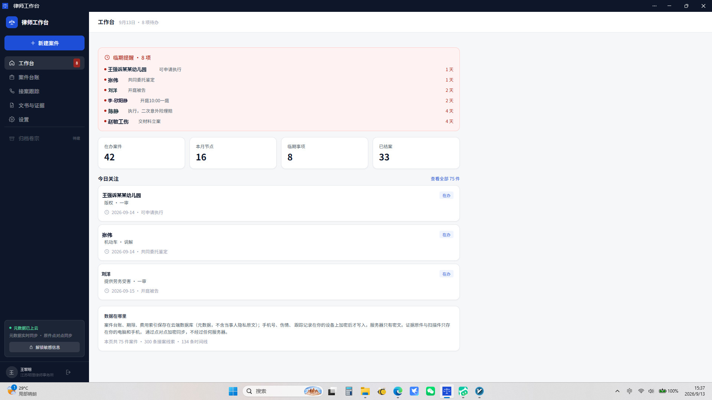
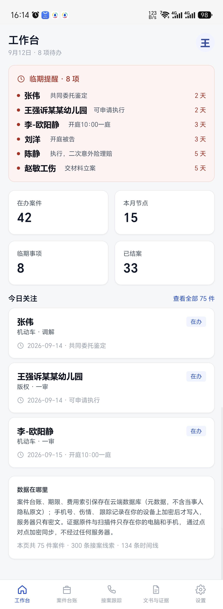

# 律师工作台

电脑端和手机端共用的案件管理工具。**响应式 PWA**：一套代码，手机「添加到主屏幕」即成 App，电脑浏览器打开直接用。

**不内置任何数据**——首次使用需要接上你自己的云数据库，然后通过应用界面录入。手机号、身份证、伤情等敏感字段一律**端到端加密**入库，主口令永不离开浏览器内存；即使数据库被拖走，没有口令也只是一堆乱码。

<p align="center">
  
  &nbsp;&nbsp;
  
  <br />
  <sub>工作台首页 · 左：电脑端　右：手机端（响应式同一套代码；示例数据，非真实案件）</sub>
</p>

👉 **想动手搭建？看 [docs/SETUP.md](./docs/SETUP.md)**——选数据库、建表、配 `.env`、上 RLS、部署、PWA 安装，一步不漏。

---

## 特性

- **响应式 + PWA**：手机 / 平板 / 电脑一套代码，「添加到主屏幕」离线壳可用
- **端到端加密**（PBKDF2-SHA256 21 万轮 + AES-256-GCM），密钥仅在浏览器内存
- **数据层零绑定**：只依赖 PostgREST 标准 REST，可切换 腾讯云 CloudBase / MemFire / Supabase，换平台改两行配置
- **行级安全（RLS）**：未登录读不到任何数据
- **证据原件不上云**：本机 + Verysync 端到端直连，工作台只登记索引
- **案件台账 + 临期提醒 + 详情 + 时间线 + 费用 + 材料登记**
- **手机号始终脱敏展示**（`150****9528`），解锁后显示完整号码并可一键拨号

---

## 快速开始

需要 **Node.js 18+**（`node -v` 看版本）和 git。

```bash
git clone https://github.com/william-smith/lvshigongzuotai.git lawyer-workbench
cd lawyer-workbench
npm install
npm run dev      # 本地浏览器打开默认 http://localhost:5173
```

未配置数据库时页面只有登录框——按 [SETUP.md](./docs/SETUP.md) 接上你的云数据库即可开用。

---

## 文档

- 📖 **[docs/SETUP.md](./docs/SETUP.md)** —— 完整搭建手册（选平台 / 建表 / `.env` / E2E / RLS / 部署 / PWA）
- 📂 **[目录结构](#目录结构)** —— 代码组织一览

---

## 数据保护

- **端到端加密**（PBKDF2-SHA256 21 万轮 + AES-256-GCM）——密钥仅在浏览器内存
- **服务端拿不到明文**——只有你能解
- **数据层零绑定**——换平台不改加密逻辑
- **行级 RLS 隔离**——每个账号只看自己的数据

主口令忘了**不可找回**。详细实操见 [SETUP.md §4](./docs/SETUP.md#4-端到端加密设主口令)。

---

## 部署

`npm run build` 产物在 `dist/`，**纯静态**——丢到任意静态托管都行（Vercel / Netlify / Cloudflare Pages / COS / 自建 Nginx 都可），单页路由 fallback 别忘。详细见 [SETUP.md §6](./docs/SETUP.md#6-部署静态站点)。

---

## PWA 安装

部署完公网 HTTPS 后，手机浏览器打开 → 菜单 → **「添加到主屏幕」**；桌面浏览器地址栏右侧会出现「安装」图标。详细见 [SETUP.md §7](./docs/SETUP.md#7-pwa-安装)。

---

## 添加案件（看一眼流程）

登录 + 解锁后点 **「新增案件」**：

| 字段 | 说明 |
|---|---|
| 委托人姓名 | 自动 E2E 加密 |
| 案号 | 法院/仲裁给的 |
| 案由 | 劳动 / 工伤 / 人损 / 其他 |
| 收案日期 | 用于临期排序 |
| 对方当事人 | 「+」加行 |
| 标的额 | 选填 |
| 备注 | 选填 |

保存后可加时间线、费用、接案访谈、材料登记。

---

## 目录结构

```
lawyer-workbench/
├── src/                # 前端代码（React + TS + Tailwind）
│   ├── components/     # 通用组件（Nav / Icon / DocPreview / …）
│   ├── pages/          # 业务页面（CaseList / Dashboard / Settings …）
│   ├── lib/            # 数据/加密/文件访问工具
│   ├── store/          # 全局状态（保险箱会话）
│   ├── App.tsx         # 路由根
│   └── main.tsx        # 入口（含 PWA SW 注册、preconnect）
├── supabase/           # 数据库 schema + RLS
│   ├── schema.sql               # 业务表
│   ├── docs_schema.sql          # 文件/文件夹映射
│   └── rls_uid_isolation.sql    # 行级安全
├── scripts/            # 运营脚本（auth/迁移/check-api …）
├── public/             # 静态资源（icons、manifest.webmanifest、sw.js）
├── docs/
│   ├── SETUP.md        # 完整搭建手册
│   └── images/         # README 配图（示例数据，已脱敏）
├── .env.example        # 环境变量样板（**不要提交 .env**）
├── index.html
├── vite.config.ts
├── tailwind.config.js
└── package.json
```

构建后 `dist/` 即部署产物。

---

## 当前状态

- **完成度**：核心台账 + 临期提醒 + 案件详情 + 时间线 + 费用 + 接案 + 材料登记 + E2E 加密 + RLS + PWA，全链路打通
- **不内置数据**：本仓库不含任何演示/种子数据，需自行接数据库
- **数据层兼容**：PostgREST 标准 REST（Supabase / CloudBase for Supabase / MemFire 三家任选）
- **状态**：个人/小所规模生产可用；性能、海外体验、群组协作是已知演进方向

---

## 安全须知

⚠️ **public 仓库严禁提交真实当事人信息**——案件数据用合成样本，所有敏感字段走 E2E 加密。

⚠️ **生产部署前必开 RLS**——详见 [SETUP.md §5](./docs/SETUP.md#5-登录与权限部署到公网前必做)。

⚠️ **主口令无法找回**——找个密码管理器记一份。

⚠️ **VITE_API_KEY 必须是 anon 角色**——不是 service_role！后者拥有完全数据库权限。

⚠️ **定期备份**——自带脚本可导出全表 JSON 快照（含校验和与保留策略）：`npm run backup`，恢复用 `npm run restore --from <快照目录>`。详见 [SETUP.md §9](./docs/SETUP.md#9-数据备份与恢复)。

---

## License

MIT。
